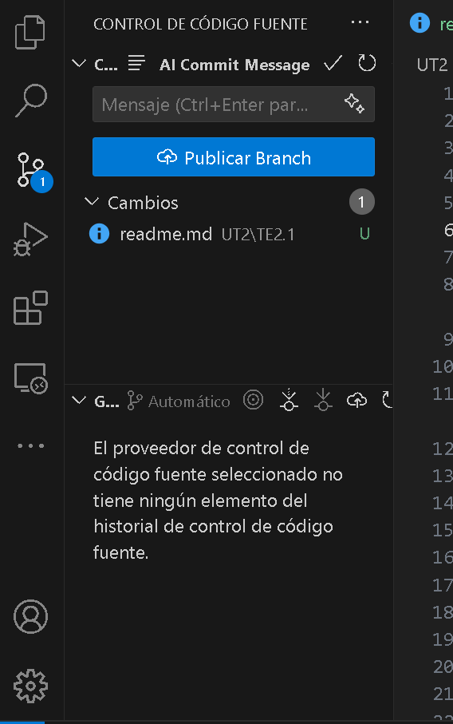
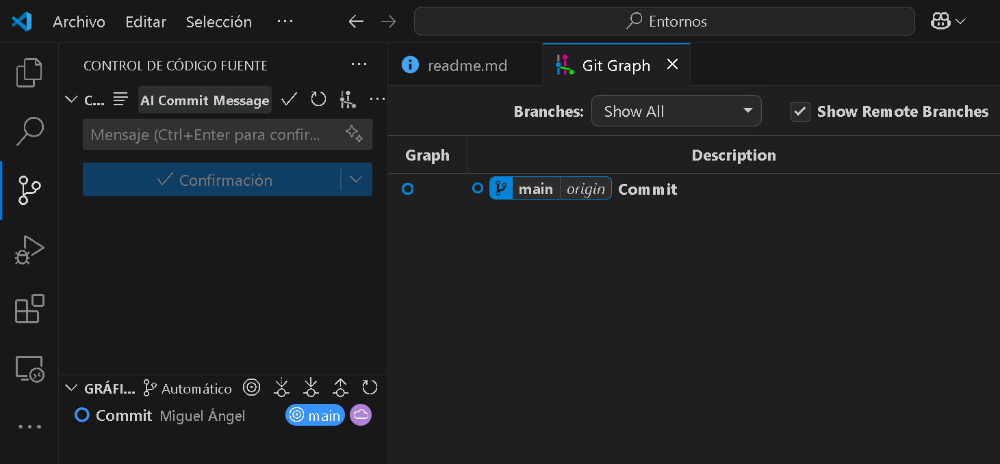
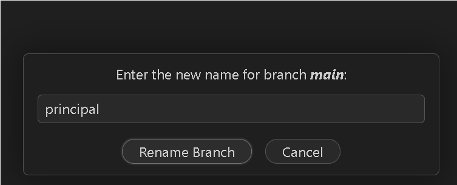

1 Crear repositorio local y subir a GITHUB

1. Crea una carpeta llamada UT2.1.a.

2. Inicializa un repositorio local en la carpeta UT2.1.a. adjunta la imagen
--> imagen de ejemplo, sustituye por el nombre de la imagen.

3. Revisa qué rama se ha creado por defecto. ¿Desde dónde los visualizas? adjunta la imagen
   Desde gitGraph

4. Renombrar la rama por defecto a main en caso de que tenga otro nombre. 
   

5. Agrega un fichero README.md.

# UT2.1.a

Repositorio de prueba para la tarea 2.1.a

Agrega el fichero README.md al stage area. adjunta un gif

Realiza un commit con el mensaje "Add README". adjunta un gif

Agrega otro fichero 01.xml con siguiente texto.

<?xml version="1.0" encoding="UTF-8"?>
<libreria>
    <libro>
        <titulo>El Quijote</titulo>
        <autor>Miguel de Cervantes</autor>
        <editorial>Editorial Castalia</editorial>
        <fecha>1605</fecha>
        <genero>Novela</genero>
        <precio>20</precio>
    </libro>
</libreria>

Agrega el fichero 01.xml al stage area y realiza el commit "Add file 01.xml" adjunta un gif

Agrega una nueva rama llamada fea/wac01 con la ayuda git-graph. adjunta un gif

En qué rama estas ahora mismo? ¿Cómo sabes en qué rama estás? adjunta la imagen y explica en breves palabras.

// Respuesta

Rama actual

Estando en la rama fea/wac01 agrega un fichero 02.xml, y agrega al área de stage y realiza commit "Add file 02". adjunta un gif

<?xml version="1.0" encoding="UTF-8"?>
<libreria>
    <libro>
        <titulo>El Hobbit</titulo>
        <autor>J.R.R. Tolkien</autor>
        <editorial>Minotauro</editorial>
        <fecha>1937</fecha>
        <genero>Fantasía</genero>
        <precio>15</precio>
    </libro>
</libreria>

Muestra el log (pantalla de git-graph donde se visualize el commit). adjunta la imagen
Log rama fea/wac01

Posicionate de nuevo en la rama main, y crea otra rama fea/wac02, posicionandote directamente en ella. Agrega un fichero 03.xml, agrega al área de stage y realiza commit "Add file 03".

<?xml version="1.0" encoding="UTF-8"?>
<libreria>
    <libro>
        <titulo>El Señor de los Anillos</titulo>
        <autor>J.R.R. Tolkien</autor>
        <editorial>Minotauro</editorial>
        <fecha>1954</fecha>
        <genero>Fantasía</genero>
        <precio>25</precio>
    </libro>
</libreria>

Posicionate en la rama main y muestra los ficheros que hay en el directorio. (mostrar el arból de directorios de VS Code). adjunta la imagen
Ficheros en main

Realizar un merge de la rama fea/wac01 en la rama main. adjunta un gif

Muestra el el log, y los ficheros que hay en el directorio. (mostrar el arból de directorios de VS Code) adjunta la imagen

Elimina la rama fea/wac01 sin posibilidad de recuperación. adjunta un gif

Realiza un merge de la rama fea/wac02 en la rama main. adjunta un gif

Muestra el log, y los ficheros que hay en el directorio. (Imagen) adjunta la imagen Log y ficheros en main

Vuelve a la rama fea/wac02 y modifica el fichero 03.xml añadiendo un nuevo libro.

<?xml version="1.0" encoding="UTF-8"?>
<libreria>
    <libro>
        <titulo>El Señor de los Anillos</titulo>
        <autor>J.R.R. Tolkien</autor>
        <editorial>Minotauro</editorial>
        <fecha>1954</fecha>
        <genero>Fantasía</genero>
        <precio>25</precio>
    </libro>
    <libro>
        <titulo>El Silmarillion</titulo>
        <autor>J.R.R. Tolkien</autor>
        <editorial>Minotauro</editorial>
        <fecha>1977</fecha>
        <genero>Fantasía</genero>
        <precio>25</precio>
    </libro>
</libreria>

Agrega al área de stage y realiza commit "Update 03 file. Add book El Silmarillion".
adjunta un gif, donde se visualize el contenido del fichero y el commit

Realiza un merge de la rama fea/wac02 en la rama main. adjunta un gif

Muestra el log del repositorio, y muestra el contenido del fichero 03.xml. (Imagen visualizando comandos) adjunta gif

Ahora, en la rama main modifica el fichero 03.xml incluyendo un nuevo libro.

<?xml version="1.0" encoding="UTF-8"?>
<libreria>
    <libro>
        <titulo>El Señor de los Anillos</titulo>
        <autor>J.R.R. Tolkien</autor>
        <editorial>Minotauro</editorial>
        <fecha>1954</fecha>
        <genero>Fantasía</genero>
        <precio>25</precio>
    </libro>
    <libro>
        <titulo>El Silmarillion</titulo>
        <autor>J.R.R. Tolkien</autor>
        <editorial>Minotauro</editorial>
        <fecha>1977</fecha>
        <genero>Fantasía</genero>
        <precio>25</precio>
    </libro>
    <libro>
        <titulo>El Hobbit</titulo>
        <autor>J.R.R. Tolkien</autor>
        <editorial>Minotauro</editorial>
        <fecha>1937</fecha>
        <genero>Fantasía</genero>
        <precio>15</precio>
    </libro>
</libreria>

Agrega al área de stage y realiza commit "Update 03 file. Add book El Hobbit".
adjunta un gif, donde se visualize el contenido del fichero y el commit

Agrega un nuevo fichero 04.xml sobre libros ciencia-ficcion, en la rama main.

<?xml version="1.0" encoding="UTF-8"?>
<libreria>
    <libro>
        <titulo>El fin de la eternidad</titulo>
        <autor>Isaac Asimov</autor>
        <editorial>Edhasa</editorial>
        <fecha>1955</fecha>
        <genero>Ciencia ficción</genero>
        <precio>20</precio>
    </libro>
</liberia>

Agrega al área de stage y realiza commit "Add 04 file. Add cienca-ficcion books".

Muestra el registro de commits (log) y los ficheros que hay en el directorio. adjunta una imagen
Log y ficheros en main

Vuelve un commit atrás, y muestra el log y los ficheros que hay en el directorio. adjunta un gif

Vuelve al commit anterior, y muestra el log y los ficheros que hay en el directorio. adjunta un gif

Posicionate de nuevo en el último commit, y muestra el log y los ficheros que hay en el directorio. adjunta un gif

2. Crear repositorio remoto y subir a GITHUB

Crea un repositorio remoto en GITHUB llamado EEDD_{NombreApellido}_TE2.1 público, vacio, sin nada.

Agrega el repositorio remoto a tu repositorio local. Explica cómo lo haces, y adjunta una imagen donde se visualizen las url's
Repositorio remoto

 // Comentario
 

Sube la rama main al repositorio remoto. adjunta un gif

Posicionate en la rama fea/wac02 y sube la rama fea/wac02 al repositorio remoto. adjunta un gif

Ahora desde GITHUB (web) en la rama fea\wac02, modifica el fichero 03.xml añadiendo un nuevo libro.

<?xml version="1.0" encoding="UTF-8"?>
<libreria>
    <libro>
        <titulo>El Señor de los Anillos</titulo>
        <autor>J.R.R. Tolkien</autor>
        <editorial>Minotauro</editorial>
        <fecha>1954</fecha>
        <genero>Fantasía</genero>
        <precio>25</precio>
    </libro>
    <libro>
        <titulo>El Silmarillion</titulo>
        <autor>J.R.R. Tolkien</autor>
        <editorial>Minotauro</editorial>
        <fecha>1977</fecha>
        <genero>Fantasía</genero>
        <precio>25</precio>
    </libro>
    <libro>
        <titulo>El Hobbit</titulo>
        <autor>J.R.R. Tolkien</autor>
        <editorial>Minotauro</editorial>
        <fecha>1937</fecha>
        <genero>Fantasía</genero>
        <precio>15</precio>
    </libro>
    <libro>
        <titulo>El hombre bicentenario</titulo>
        <autor>Isaac Asimov</autor>
        <editorial>Edhasa</editorial>
        <fecha>1976</fecha>
        <genero>Ciencia ficción</genero>
        <precio>20</precio>
</libreria>

Realiza un commit con el mensaje "Update 03 file. Add book El hombre bicentenario". (Muestra pantallazo de GITHUB con el commit realizado) adjunta la imagen

Ahora obten los cambios sin acualizar el repositorio local (git fetch origin).
Muestra el log del repositorio local adjunta la imagen

Ahora actualiza el repositorio local con los cambios del repositorio remoto (git pull) y muestra el log. adjunta un gif

Haz un merge de la rama fea/wac02 en la rama main. Muestra estado, log, y el contenido fichero 03.xml (Incluye imagen) adjunta un gif

Sube la rama main al repositorio remoto. adjunta una gif

Elimina la rama local fea/wac02 sin posibilidad de recuperación. adjunta un gif

Elimina la rama remota fea/wac02 sin posibilidad de recuperación

// Respuesta

Muestra desde GITHUB (navegador web) las ramas que tienes el en repositorio remoto. adjunta un gif

    Para finalizar, muestra el log del repositorio local (Incluye imagen) adjunta la imagen
    Log

3. Enlace repositorio remoto
Incluye el enlace al repositorio remoto en este punto para que el profesor pueda acceder a él.

 // Enlace al repositorio remoto (en que aparece en la URL del navegador)
 
